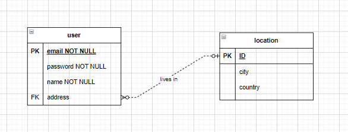

# Assignment 3

The Weather is a web application that will (eventually) display (1) the current weather for Chicago and (2) graph its forecast.

It also allows registered users to input their address to then view the weather of.

## ERD Diagram

## Testing Strategy

The current tests test the passwordValidator function in validator.js. So far, this is the only file (and function) that contains application logic.

The tests may be found in validator.test.js. Above each test is description of what it tests for. See the end of this file for the descriptions here.

8 tests test passwords that should result in a failure. These tests ensure that a password that does not meet any condition is rejected.

3 tests test passwords that meet the conditions.

The conditions are:

1. no spaces,
2. contains letters,
3. contains digits,
4. contains an uppercase letter,
5. contains a lowercase letter,
6. is not on a blacklist of common passwords, and
7. length no less than 8.

There is currently full coverage, as this so far is the only file (and function) with logic as shown by "jest --coverage".

### Test Descriptions

√ validation returns false on password with space (1 ms)

√ validation returns false on password with no letters

√ validation returns false on password with no digits

√ validation returns false on password with no uppercase

√ validation returns false on password with no lowercase

√ validation returns false on blacklisted password (1 ms)

√ validation returns false on blacklisted password

√ validation returns false on short password

√ validation returns true on passwords passing all checks #1

√ validation returns true on passwords passing all checks #2

√ validation returns true on passwords passing all checks #3
